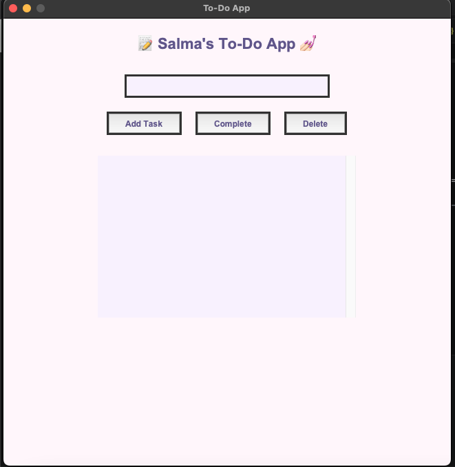

# To-Do GUI App

A modern pastel-themed To-Do List desktop application built using Python and Tkinter.

## ✨ Features
- Add tasks
- Mark tasks as completed
- Delete tasks
- Scrollable task list
- Pastel-themed graphical user interface
- Automatic task saving using JSON
- User-friendly desktop application

## 🛠️ Technologies Used
- Python
- Tkinter
- JSON

## 📂 Project Structure

```bash
.
├── todo.py
├── tasks.json
└── README.md
```

▶️ How to Run:

Make sure Python is installed.

Run the following command in terminal:
python todo.py

💾 Data Storage

Tasks are automatically saved in tasks.json.

🎯 Project Objective

This project was developed as part of the Python Development Internship Program to demonstrate:

GUI development using Tkinter
File handling with JSON
Event-driven programming
User interface customization

👩‍💻 Author

Salma

## 📸 Screenshots

### Main Interface


### Task Management

